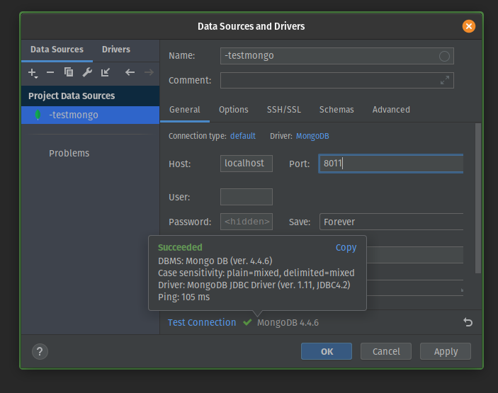
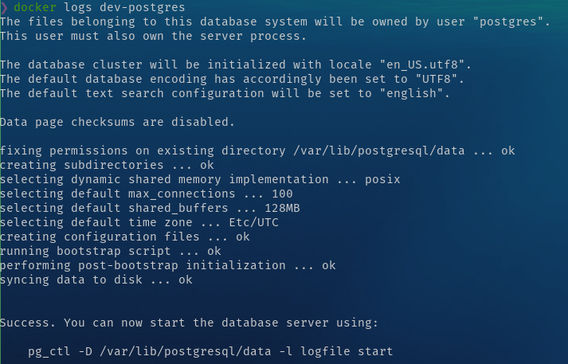

# Docker Tutorial - Beginner's guide

## Prelude

This post will give you basic tutorial how to using Docker. The topics that will explained are:

- What is docker 
- Docker Architecture
- Start using Docker (Guide to use basic commands)
- Create Image using Dockerfile
- Handle Image using Environment Variable
- Integrate Container Networking
- Manage Data in Docker
- Docker Compose
- Docker Tools
- Docker Cheatsheet

This post will be quite long, hope you will enjoy it, and feel free to give feedbacks to help me improve this tutorial.

Thanks, and enjoy it!

## What Is Docker? 


Docker is a configuration management tool that is used to automate the  deployment of software in lightweight containers. These containers help  applications to work efficiently in different environments. Using Docker, developers can easily build, pack, ship, and run  applications as lightweight, portable, self-sufficient containers, which can run virtually anywhere.  Containers allow developers to package an  application with all of its dependencies and deploy it as a single unit. By providing prebuilt and self-sustaining application containers,  developers can focus on the application code and use without worrying  about the underlying operating system or deployment system.


## Docker Architecture

The core concepts of Docker are images and containers. A Docker image contains everything that is needed to run your software: the code, a  runtime (for example, Java Virtual Machine (JVM), drivers, tools,  scripts, libraries, deployments, and more.

A Docker container is a running instance of a Docker image.  However, unlike in traditional virtualization with a type 1 or type 2  hypervisor, a Docker container runs on the kernel of the host operating  system. Within a Docker image there is no separate operating system, as  illustrated below.

​			


Every Docker container has its own file system, its own network stack  (and therefore its own IP address), its own process space, and defined  resource limitations for CPU and memory. Since a Docker container does  not have to boot an operating system, it starts up instantly. Docker is  about isolation, i.e., separating the resources of a host operating  system, as opposed to virtualization, i.e., providing a guest operating  system on top of the host operating system.


- ### Image

  Image is a read-only file with a bunch of instructions. When these instructions are executed, it creates a Docker container. We can say, that image is template to create a container.

- ### Container

  Container is a software package that has all the dependencies required to run an application. When running a container, it uses an isolated filesystem.

- ### Container Registry

  Docker Container Registry is place where we put docker image remotely before we deploy it to server. In other way it is a standard way to store and distribute Docker images. It also help improve access control and security of docker images that stored in its repository. While manage the distribution of images, it also can integrate with application development workflow, developers can setup their own Container Registry because it is an open source-based repository under the permissive Apache license, or you can using a hosted Container Service such as Docker Hub, Azure Container Registry, etc. 


## Installing a Docker

There are many tutorials how to install Docker into your machine, for me, i prefer using the official document.  You can see the instruction [here]().


## Start Using Docker

- ### Pull Image from Registry

  - #### Check image on our local

    to see list images in our local computer, we can use command:

    ```sh
    $ docker images
    ```

    

    

    if you newly install docker, you wont see anything on the list, you will just see the header result, `REPOSITORY`, `TAG`, `IMAGE ID`, `CREATED`, `SIZE`

  - #### Pull the image

    To pull an image you can use command:

    ```sh
    $ docker pull <image-name>
    ```

    or for specific image version

    ```sh
    $ docker pull <image-name>:<tag-name>
    ```

    

    For this example, we will use mongo db image, you can check it [here](https://hub.docker.com/_/mongo/),

    If you open the link, you can see on the right, there is command that tell you how to pull the image.

    

    

    

    On the `Tags` menu, you can see available version of the image

    

    

    Copy the image pull command, and run it on your terminal. You will see that the image its being pulled from the registry to our local machine.

    

    

    if we not specify the tag name it will automatically pull the latest image on the registry. After image pulling finished, we can check the images list again, you will see mongo on the list

    

    

    

- ### Create Container

  - #### Check running container

    To check running container you can use

    ```sh
    $ docker container ls
    ```

    it will show only **running** container, but if you have some container that stopped it wont show on the list.

    To show all container that we have we can use

    ```sh
    $ docker container ls --all
    ```

    You can use `--all` or `-a`, it will show all your container you have on your local machine.

    

    

    You can see on the image there are some container running, and some container stopped

    

  - #### Creating container

    There are many way to create container, these command are:

    ```sh
    $ docker container create <image-name> 
    ```

    to create container with specific image tag

    ```sh
    $ docker container create <image-name>:<tag>
    ```

    to create container with predefined name, we can use `--name` argument on our command

    ```sh
    $ docker container create --name <some-container-name> <image-name>:<tag>
    ```

    

    For the example, lets create container for our pulled mongo image,

    ````sh
    $ docker container create --name test-mongo mongo 
    ````

    

    

    lets check it using our container,

    

    

    you can see, that there is no `test-mongo` container. This is happend because when using `docker container create` command, it just create the container and not started it.  You can try using `docker contaner ls -a` command to see the container.

    You can also create multiple container from the same image with one condition, the container name must be different, because container name is unique. 

    If you create a container without specifying the name, Docker will generate random name for the container.

    

- ### Start Container

  After we create the container, we can run it using command

  ```sh
  $ docker container start <container-name>
  ```

  

  

  after we run the command, lets check our container list,

  

  as you can see, our `test-mongo` already up and running. In our case, you can see `PORTS` section of `test-mongo` container, we can access the container by using port `27017`.

  Lets try connect to mongo, you can use and DB client that support mongo connection like [Robo3T](https://robomongo.org/), but here I'm using Datagrip.

  

  

  So, we can't connect to our mongo db. Why this happening? Well, this is because `PORTS` info that we see before, is port on the container. The behavior of container is, it will creste an isolate the system , it means that we can't access the system without exposing the port, so it cant access to the outside of container.

  

- ### Open Port

  So, how we can exposing port of the container? To achieve that, we should passing argument `-p` or `--port` when we create the container, so the command will look like this

  ```sh
  $ docker container create --name <container-name> -p <external-port>:<container-port> <image-name>:<tag>
  ```

  Let's try create a new container

  

  

  I will explain the command. 

  `internal-port` is predefine port that already assign when build the image. If we using image that we get from the docker registry, we can see the documentation of the image for ports information. In this case, mongo using port `27017`.

  And in the `external-port`, i use port `8011`. It means,  when I'm use port 8011 outside the container (or on my local machine), every request that come through port `8011` will be forwarded to port `27017` inside the container.

  

  Try start the new container, and with this we can access the mongo db.

  

   

- ### Remove Container

  To remove the container we use command 

  ```sh
  $ docker container rm <container-name>
  ```

  Let's try to delete `test-mongo` container

  

  Error will occurred. This is happened because Docker wants that we to stop the container before we remove it. There is two way to handle this, 

  1. Stop the container using

     ```sh
     $ docker container stop <image-name>
     ```

     and then run the container remove command again

  2.  Force delete the contianer by using argument `--force`

     ```sh
     $ docker container rm <image-name> --force
     ```

     please ensure that you know what you doing when use this command.

  

  For this exmple i will use option 2,

  

  

  You can try check the container list again to ensure the container is already removed.

  

- ### Remove Image

  Same with removing the container , we can't remove an image before all container that use that image is removed.  To remove an image you can use command

  ```sh
  $ docker image remove <imange-name>:<tag>
  ```

  Let's stop and remove the container, and then remove the `mongo` image

  

  

- ### Docker Logs

  We can see docker logs to help us debug our application inside the container. To do that, we can use command

  ```sh
  $ docker logs <container-name>
  ```

  You can try create some container and chek the container's logs. This is example of my `Postgres` container.

  

  

- ### Getting through inside the container

  Even container is isolated from the outside, Docker has prepared some command that we can use to pass a command inside our container.  We can use command

  ```sh
  $ docker exec <option> <container-name> <command> 
  ```

  you can see more about docker exec [here](https://docs.docker.com/engine/reference/commandline/exec/)

  

  I will demonstrate using my `postgre` named 'dev-postgre' to get into postgre client inside the contianer.

  

  

  You can see that I running command to show database list inside the container. `-it` means `interactive` (Keep STDIN open) and `tty` (Allocate a psuedo-TTY).

  

## Create Image with Dockerfile

We have already using docker with image that we get from container registry, but how if we want to create image? Heres comes the `Dockerfile`. `Dockerfile` is a simple text file that consist of instruction to build Docker images. Dockerfile consists of specific commands that guide you on how to build a specific Docker image. 

For the example, we need to prepare some code, o demonstrate how to buil an image of sn application. We will create 2 files, application code an the Dockerfile. For the application code i will create simple HTTP app using Go. You don't need to have Go runtime on your computer, because we will our app inside the container than have Go runtime in it.


- ### Prepare an app

  ```go
  package main
  
  import (
  	"fmt"
  	"net/http"
  )
  
  func main() {
  
  
  	// * Handle Route "/"
  	http.HandleFunc("/", func(w http.ResponseWriter, r *http.Request) {
  		fmt.Fprintf(w, "<h1>Hello Docker!</h1>")
  	})
  
  
      http.ListenAndServe(":8000", nil)
  }
  ```

  

- ### Create a Dockerfile

  ```dockerfile
  # BUILD IMAGE FROM EXISTING IMAGE
  
  # 1. Call the image
  # FROM <image name>:<tag>
  # for the base we will use golang image version 1.15
  FROM golang:1.15
  
  # 2. Copy file that needed in this image
  # COPY <source> <destination>
  # we will put file main.go in /app/main.go inside the container
  COPY main.go /app/main.go
  
  # 3. Telling the image how to run the app
  # CMD [<add command using array>]
  CMD ["go", "run", "/app/main.go"] # same with "go run /app/main.go"
  ```

  

- ### Build image 

  we can use 3 way to build an image:

  1. simple way

     `docker build <path-to-dockerfile>`

  2. add name in our image

     `docker build --tag <app name> <path-to-dockerfile>`

  3. add name and version number

     `docker build --tag <app name>:<version number> <path-to-dockerfile>`
     
     

  ```sh
  $ docker build --tag app-golang:1.0 .
  ```

  

  

  building an image using Dockerfile can be done in various ways, depends on your needs, and there are many Dockerfile syntax that often used when build an image, such as:

  - ENTRYPOINT
  - RUN
  - WORKDIR
  - ENV

  read this docker **[documentation](https://docs.docker.com/develop/develop-images/dockerfile_best-practices/)**, to get to know all the syntax, and see the best practice how to use it.

  

- ### Create our app contianer

  Let's try create container for our app and run it. Then we can check our app using browser. 

  

  

- ### Upload Image to Registry

  - #### Preparation

    - Login to your account in https://hub.docker.com/

      

    - Create New repository for the image

      
      
      

  - #### Push image

    We will use docker command to push the image, `docker push <repository name>:<tag>`

    

    

    If we try insert the command, we will get error: `An image does not exist locally ...`

    

    
  
    this is will happen, because we create an image with name that different with our repository name, lets check the image in our local, using: 

    ```sh
    $ docker images
    ```
    
    
    
    
    
    our local image named **app-golang** but docker registry wants **repoerna/example-go-app**.
    
    
    
    To resolve this, we need to do create image with different name by using
    
    ```sh
    $ docker tag <local-image>:<tagname> <reponame>:<tagname>
    ```
    
    
    
    check docker images in our local, we will see new image created, 
    
    
    
    
    
    after that we can push to the repository, by using same command we used before
    
    
    
    
    
    Oops! We still get an error, our request to push is denied. It is because, our local docker didn't know, where to push the image. 
    
    We need to login, by using
    
    ```sh
    $ docker login
    ```
    
    
    
    input your account credential for the docker hub
    
    
    
    
    
    after we logged in, lets try to push again
    
    
    
    
    
    Alright! We success push our local image to remote repository, lets check in docker hub
    
    


​			

​			For details about docker repository you can read the **[documentation](https://docs.docker.com/docker-hub/repos/)**


## Handle Image with Environment Variable

> An **environment variable** is a dynamic-named value that can affect the way running processes will behave on a computer. They are part of the environment in which a process runs. **-- [Wikipedia]((https://en.wikipedia.org/wiki/Environment_variable))**


Environment variable rarely used directly.  it usually used by program to configure itself. In software development, some configuration for the program/ application are set by using environment variable. By doing this, if we want to our program change some configuration, we can achieve this by change the environment variable, without changing the code.


in Linux or MacOS you can see your OS environment variable using command

```sh
$ printenv
```


if you using Windows OS , you can access environment variable by open **Control Panel  >  Advanced system settings  >  Environment Variable**, you will see Environment Variable window.


 

If we want dockerize our program that need environment variable in it, we should add some command before run the container.

To give you an example, lets update our program to handle some environment variable. We will add new route to handle the environment variable.

```go
package main

import (
	"fmt"
	"net/http"
	"os"
)

func main() {
package main

import (
	"fmt"
	"net/http"
	"os"
)

func main() {
	// * this will set env variable MYNAME
	// os.Setenv("MYNAME", "REPOERNA")

	// * get env variable MYNAME
	appPort := os.Getenv("APP_PORT")
	port := fmt.Sprintf(":%s", appPort)

	myName := os.Getenv("MYNAME")
	txt := fmt.Sprintf("<h1>Hello, %s</h1>", myName) // <-- env var MYNAME will be used in this line

	// * Handle Route "/"
	http.HandleFunc("/", func(w http.ResponseWriter, r *http.Request) {
		fmt.Fprintf(w, "<h1>Hello Docker!</h1>")
	})

	// * Handle route "/myname"
	http.HandleFunc("/myname", func(w http.ResponseWriter, r *http.Request) {
		fmt.Fprintf(w, txt)
	})

	http.ListenAndServe(port, nil) // <-- env var APP_PORT will be used in this line
}

```


Remember, in our program we need two environment variable, APP_PORT and MYNAME. After updating our program, re-build  it without change the dockerfile.

```sh
$ docker build --tag app-golang:1.0 .
```


and then create container using the image, and add '-e'  to add environment variable

```sh
$ docker container create --name golang-test-env -p 8080:8080 -e APP_PORT=8080 -e MYNAME=REPOERNA app-golang:1.0
```


after container created, lets inspect environment variable in it by using command

```sh
$ docker container inspect golang-test-env
```


In the list you will see in `Env` with `APP_PORT` and `MYNAME` variable with its value same with command that we type before. For `PATH`,  `GOLANG_VERSION`, `GOPATH` are automatically added, because we use golang in our dockerfile.


So lets run the container, to check our program is working

```sh
$ docker container start golang-test-env
```


if no error occur, open in browser *localhost:8080/myname*, it will shows the `MYNAME` environment variable value`


*Note: when using a Dockerfile to create an image you can also specify the environment variable inside your Dockerfile. Please see the official documentation how to implement that.


## Integrate Container Networking

In this section we will talk about connecting container to another container. Let say we have web server that needs to connect with postgres for its database, and redis for its caching or session storage


So, we will prepare 3 container, one for app, one for postgre, and one for redis. Before that, lets prepare our app. We will be using our previous app, and add some code to connect with postgre and redis.


- ### Update our app 

  - #### main.go

    We will add some database connection in our app.

    ```go
    Package main
    
    import (
    	"database/sql"
    	"fmt"
    	"net/http"
    	"os"
    
    	"github.com/go-redis/redis"
    	_ "github.com/lib/pq"
    )
    
    func main() {
    
    	dbHost := os.Getenv("DB_HOST")
    	dbPort := 5432
    	dbUser := "postgres"
    	dbPass := "Secure123"
    	dbName := "docker-demo"
    	redisHost := os.Getenv("REDIS_HOST")
    	redisAddr := fmt.Sprintf("%s:6379", redisHost)
    	redisPass := "" //no password set
    	redisDB := 0    //default db
    
    	// * setup postgre connection
    	dsn := fmt.Sprintf("host=%s port=%d user=%s "+
    		"password=%s dbname=%s sslmode=disable",
    		dbHost, dbPort, dbUser, dbPass, dbName)
    	db, err := sql.Open(
    		"postgres",
    		dsn,
    	)
    	if err != nil {
    		fmt.Println(err)
    	}
    
    	// * Ping for test the connection
    	if err = db.Ping(); err != nil {
    		fmt.Println(err)
    	} else {
    		fmt.Println("DB Postgres Connected !")
    	}
    
    	// * setup redis connection
    	rdb := redis.NewClient(&redis.Options{
    		Addr:     redisAddr,
    		Password: redisPass,
    		DB:       redisDB,
    	})
    
    	// * Ping for test the connection
    	pong, err := rdb.Ping().Result()
    	if err != nil {
    		fmt.Println(err)
    	} else {
    		fmt.Println(pong)
    		fmt.Println("Redis Connected !")
    	}
    
    	// * get env variable MYshNAME
    	appPort := os.Getenv("APP_PORT")
    	// handle for default port
    	if appPort == "" {
    		appPort = "8080"
    	}
    	port := fmt.Sprintf(":%s", appPort)
    
    	// myName := os.Getenv("MYNAME")
    	// txt := fmt.Sprintf("<h1>Hello, %s</h1>", myName)
    
    	// * Handle Route "/"
    	http.HandleFunc("/", func(w http.ResponseWriter, r *http.Request) {
    		fmt.Fprintf(w, "<h1>Hello Docker!</h1>")
    	})
    
    	// * Handle route "/myname"
    	// http.HandleFunc("/myname", func(w http.ResponseWriter, r *http.Request) {
    	// 	fmt.Fprintf(w, txt)
    	// })
    
    	http.ListenAndServe(port, nil)
    }
    ```

    

    For postgres and redis hostname, we will use environment variable,  and because we are using redis, we need to use modules in our go app, therefore we need to update our Dockerfile to handle go modules.

  

  - #### Dockerfile

    ```dockerfile
    FROM golang:1.15
    
    ENV GO111MODULE=on
    
    WORKDIR /app
    
    
    RUN go mod init
    
    COPY . .
    
    RUN CGO_ENABLED=0 GOOS=linux GOARCH=amd64 go build
    
    EXPOSE 8080
    CMD ["go", "run", "/app/main.go"]
    ```

    After the app ready, we will cotinue preparing the container and don't forget to clean up previous container

    

- ### Create Containers
  - #### Re-build our golang app image

    ```sh
    $ docker build --tag app-golang:1.0 .
    ```

    

  - #### Create golang app container

    ```sh
    $ docker container create --name golang-docker -e REDIS_HOST=localhost -e DB_HOST=localhost -p 8080:8080 app-golang:1.0 
    ```

    

  - #### Create postgres container

    ```sh
    $ docker container create --name postgres-docker -p 5432:5432 -e POSTGRES_DB=docker-demo -e POSTGRES_PASSWORD=mysecretpassword postgres
    ```

    

  - #### Create Redis container

    ```sh
    $ docker container create --name redis-docker -p 6379:6379 redis
    ```

    

    let's see our created containters

    


- ### Start Containers 

  start all 3 containers

  ```sh
  $ docker container start redis-docker postgres-docker golang-docker
  ```

  

  check our app container 

  ```sh
  $ docker container logs golang-docker
  ```

  

  

  As I expected, error will happened, because we trying connect to localhost. We can't connect to lacalhost, because redis and postgres are in different container. We need to use container name as the hostname. So, let's delete *golang-docker* container and re-create it.

  

  ```sh
  $ docker container create --name golang-docker -e REDIS_HOST=redis-docker -e DB_HOST=postgres-docker -p 8080:8080 app-golang:1.0 
  ```

  
  Start the container, and check logs again
  
  

  We still can't connect to redis and postgres. What  is happened here? As you can see, there is error occur in our app, this will happened because our program still can't find redis and postgre. Before we are using *localhost* or *127.0.0.1* as the host, localhost is used to refers the hostname in the current computer or system, and as you know, **when creating container, the system inside it will be isolated from other container**, even if we want the container to connect to our laptop or computer we need to expose container port and mapping it to our computer port. But, after we changed the hostname to the container name, errors still occured. So **how to make containers communicate each other?**

  

- ### Setup Container Network

  To achieve that we need to use **docker network**, it will help us connecting containers

  ```sh
  $ docker network --help
  ```

  
  - #### Create docker network

    ```sh
    $ docker network create example-network
    ```

    

    we can check our created network by using

    ```sh
    $ docker network ls
    ```

    

  - #### Set container network

    ```
    $ docker network connect example-network golang-docker
    $ docker network connect example-network redis-docker
    $ docker network connect example-network postgres-docker
    ```

    

  After we connect the containers to network, let's inspect our container

  ```sh
  $ docker container inspect golang-docker
  ```

  

  You can see in "Networks", there is **example-network**, that we created before.

  

  

  Let's restart our golang-app container, and check the logs

  ```sh
  $ docker container restart golang-docker
  ```

  

  

  

  Finally, it's connected! Congratulations for us!

  

## Manage Data in Docker

When creating application it best to make it stateless, it means no data are saved, or the data stored somewhere else. However there are some application that need to be stateful, for example databases. How we run stateful application how can we save the data, so when we delete a container the data will still remains?

Actually you can read the documentation about that in [here](https://docs.docker.com/storage/)

There are many way to manage data in docker, usually i will use  `bind mounts` but this time we will try to use `volume`.

In this example we will try create mongo container. To manage data, first we must know where is application save its data, if you use [mongo image from docker hub](https://hub.docker.com/_/mongo), we can see in description at subtitle `Where to Store Data`, from there we can see where is mongo data reside, its in `/data/db`.


So, let's starting ...

1. Pull image

   ```sh
   $ docker pull mongo
   ```

   

2. Create new volume

   ```sh
   $ docker create volume mongo-test
   ```

   this volume will be used in our container, this is where data will be saved, you can check where is volume stored in your computer by using command:

   ```sh
   $ docker volume inspect <volume-name>
   ```

   

   

   

3. Create container

   ```sh
   $ docker container create --name mongo-docker -v mongo-test:/data/db -p 27017:27017
   ```

   In this command we use `-v <docker_volume>:<data location in application>` to create volume binding beetwen docker and our computer. 

   

4. Start container

   ```sh
   $ docker container start mongo-docker
   ```

   

5. Open mongo DB using mongo client, here i'm using [Studio 3T](https://studio3t.com/)

   

   

   Can you see, the mongo is still new, in default there 3 db like above. Let's we create new DB and add new data in there

   

6. Ceate new DB and insert some data

   

   

   In here, I already create new `DB` named test_db, collection named `test_collection`, and inside that collection there 1 document

   

7. Stop and delete container

   ```sh
   $ docker container stop mongo-docker
   ```

   

   ```sh
   $ docker container rm mongo-docker
   ```

   

   

8. Create and start container again using same command in step 3 and 4

9. Check DB again using  Mongo client

   

   

   You will see, that your data is still there. Congratulation!

That is one method how to manage data in docker, there is still many way to manage data in docker.  Please be sure to read the [documentation](https://docs.docker.com/storage/), in there you will know what method to use and how to use it for your needs.


## Docker Compose

In previous section we already learn to integrate our containers, in that example we use 3 containers, but what if our application or system needs more than that? Doing it manually evvery step will be a problem right? So, Docker Compose will help us automate  that process.


Basically, there are 3 steps to use Docker Compose, these steps are:

1. Define your app’s environment with a `Dockerfile` so it can be reproduced anywhere.
2. Define the services that make up your app in `docker-compose.yml` so they can be run together in an isolated environment.
3. Run `docker-compose up` and Compose starts and runs your entire app.


In step 1 , we already learn how to create `Dockerfile` so we will focus in step 2, how to create `docker-compose.yml` file, and step 3, how to run it. 

lets create our`docker-compose.yml` ,

```yml
version: "3.9" # optional since v1.27.0

services:
  db:
    container_name: postgres-comose
    image: postgres
    ports:
      - 5432:5432
    networks:
      - compose-network
    environment:
      - POSTGRES_DB=docker-demo
      - POSTGRES_PASSWORD=mysecretpassword
  cache:
    container_name: redis-compose
    image: redis
    ports:
      - 6379:6379
    networks:
      - compose-network
  app:
    container_name: golang-compose
    # image: app-golang:1.0
    build:
      context: .
      dockerfile: Dockerfile
    ports:
      - 8080:8080
    restart: unless-stopped
    networks:
      - compose-network
    depends_on:
      - db
      - cache
    environment:
      - REDIS_HOST=redis-compose
      - DB_HOST=postgres-compose
      - MYNAME=REPOERNA

networks:
  compose-network:
    name: new-example-network

```

**\*Note: in `app` service environment we use `REDIS_HOST` and `DB_HOST` using redis and postgres container name**


Okay, I will explain what we write, at the root of the document, we have:

- `version` define Compose release. Each release have different features and parameter that we can use, you can read compatibility matrix of each version in [here](https://docs.docker.com/compose/compose-file/compose-versioning/). If you omitted `version` as default, it will use version 1.
- `services` defined all services in our system, in our example before we use posgres, redis, and golang app, those 3 services will be defined here.
- `network` define network will be used, if you haven't create the network, it will be automatically created and you can create more than one network here.

Inside `services` there is service name, we have db, cache, and app, on every services we will define parameter that will be used on each services. these parameters are:

- `container_name` define name services container.
- `image` define image that will be used for creating the container.
- `port` define port binding to exposed the port inside container with environment outside.
- `networks` define network that will be used by services.
- `depends_on` define other services that nedeed by app services.
- `environment` define environment variable inside the container.

In `app` service, instead using image, we will use `build` to build the image, below `build` there is `context`that define the location of dockerfle that will be used to build the image and `dockerfile` to define dockerfile filename.


To run Docker Compose, we need use some commads, you can check in your terminal by using

```sh
$ docker-compose
```

It will shows you list of commands and short description to its function, you need to know how use it properly. There are common commands that I frequently used:

- `docker-compose build`

  It will rebuild the image if you using `build` instead of `image` in your `docker-compose.yml`, if your services using existing images, there will be error ocured.

- `docker-compose up -d`

  It will create and start containers,  iit best to use`-d`  or daemon mode, to run the process in background.

- `docker-compose down`

  it will stop and remove containers, networks, images, and volumes. Please beware if you using database in your services, when you use this command, the data will also be removed.


So, lets run the Docker Compose

1. Rebuild the image

   ```sh
   $ docker-compose build
   ```

   this process will be same with `docker build`

   

2. Start services 

   ```sh
   $ docker-compose up -d
   ```

   


3. Check our application

   

   

   

   

   Our services is up! No error occurred.

   

4. Clean up

   ```sh
   $ docker-compose down
   ```

   

   

## Docker Tools - Kitematic

Docker tool is a software that you can use to help you manage docker using GUI. Docker has its own tools called Docker Desktop, but it only for Windows and MacOS. For Linux, I prefered using Kitematic because it also can run on Windows, MacOS. It also have more features than Docker Desktop. 

The featuresa are:

1. Create, delete, start & stop container
2. View containers logs
3. Managing volumes
4. Add environement variables
5. Command Line Access

You can see the details on [Kitematic website](https://kitematic.com/) or [docker documentation](https://docs.docker.com/kitematic/userguide/).


### [Docker Cheat Sheet](https://www.docker.com/sites/default/files/d8/2019-09/docker-cheat-sheet.pdf)


